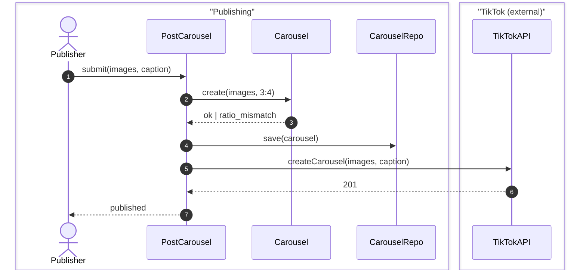

# Diagram Conventions

A diagram's value is not that it looks good. It is that **both sides see the same flow at the same time**, and that a gap becomes conspicuous: a missing arrow is visible in a drawing in a way it never is in prose. That is why a pass draws one the moment a flow changes rather than saving it for a handover.

## Which form carries which thing

| the thing under discussion | the form | why |
| --- | --- | --- |
| a flow over time, including its failures | `sequenceDiagram` | branches sit beside the happy path instead of being asserted |
| a lifecycle, or "what state is it in when…" | `stateDiagram-v2` | a state with no exit is a hole you can see |
| module depth and boundaries | a table, not a diagram | depth is *small interface, large hidden implementation* — countable, and a drawing flatters it |
| the shape of an interface | code | see the sketch/settled rule in [ARTEFACT.md](./ARTEFACT.md) |

Only diagram the flows this work changes. One diagram per flow a pass touched; a flow that already stands is referenced, never redrawn. A diagram of the whole system is a diagram nobody reads.

## Sequence diagrams

Always `autonumber`, immediately after the opening line. Participants declared with the DDD role they play, grouped by bounded context.



Failures go in the same diagram, in `alt`/`else` blocks. A failure branch that is only described in prose is a failure branch nobody has agreed on.

**Cite by label, not by number.** Numbering is for reading. Inserting a message renumbers everything below it, so a comment from an earlier pass saying *"step 7 is where the retry lives"* can point somewhere else by the time it is read. Write *"the retry lives in `createCarousel`"* in anything that outlives a single pass.

## Participants are declared, not improvised

Every participant carries a DDD role. Human roles use mermaid's `actor`; everything else uses `participant`.

| role | what it is |
| --- | --- |
| actor | a person or human role acting on the system |
| entity | a thing with identity that changes over time |
| aggregate | a consistency boundary — invariants live here |
| value object | a thing defined by its values, with no identity |
| domain service | an operation belonging to no single entity |
| policy | a rule that varies by case |
| repository | persistence, hiding the store |
| application service | orchestrates one use case |
| domain event | something worth announcing |
| port / adapter / anticorruption layer | the boundary to an external system |

The roles are the point, because **a participant that cannot be classified is a finding, not a naming problem.** It usually means two roles are being served by one thing, or a concept has not been decided yet — and finding that during alignment is the entire return on declaring them. A worked example: classifying a `Normaliser` forced the question of whether per-platform ratio rules are an aggregate invariant or a domain policy, and the answer changed where the rule lives.

Every participant resolves to a term in the repo's `CONTEXT.md`. One that does not is either a term to add — a domain-model decision, taken now — or a name that should not be in the diagram. Both are useful outcomes; leaving it unresolved is not. Record the participant table in the body, per [ARTEFACT.md](./ARTEFACT.md), and hand the model itself to `/domain-modeling`.

## Presentation

The source is **mandatory** — the fenced block in the pass's comment. Presenting the rendered diagram is optional, and no presentation is ever a precondition for the work.

1. **The harness renders mermaid inline** — show the fenced block and talk about it directly. In pi this is `markdown.mermaid`, default `streaming`.
2. **The harness can open a link** — offer a `mermaid.live` editor URL. Generate it rather than hand-encoding; the state is a deflate-compressed JSON payload:

   ```sh
   node -e 'const z=require("zlib"),c=require("fs").readFileSync(0,"utf8");process.stdout.write("https://mermaid.live/edit#pako:"+z.deflateSync(Buffer.from(JSON.stringify({code:c}))).toString("base64url"))' < diagram.mmd
   ```

   A plain `#base64:` variant exists that needs no compression, at the cost of a longer URL.
3. **Neither** — post the fenced block in the pass's comment and leave it at that. GitHub and Linear both render the diagram wherever the ticket lives, so the link is a convenience and not a requirement.

## Compatibility

GitHub and Linear each pin their own mermaid build, so feature age is a render risk.

- `autonumber` — ancient, safe everywhere. Start and increment values (`autonumber 10 10`) arrived in v11.15; the bare form is enough.
- `box` — newer, and safe in current builds, but keep it to a single level. Nested boxes are the newest thing here.
- Before adopting a newer construct across the whole artefact, push one throwaway diagram to a scratch issue and check it renders. Once, cheaply, rather than discovering it in a review.
- **The pass comment that changed the flow is the home**, so this is where a render risk bites: GitHub renders mermaid in issue bodies and comments; Linear's editor takes a mermaid fence (`/diagram`). Check the Linear comment case once on a scratch issue before relying on it.
