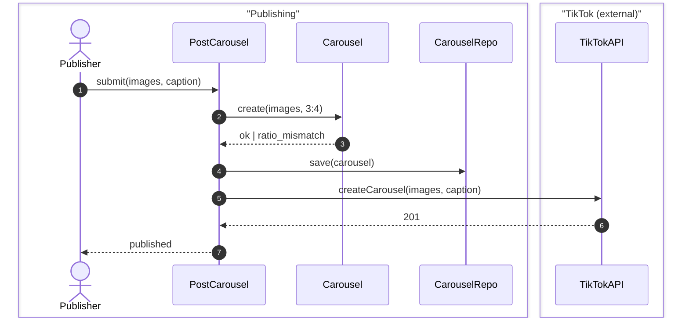

# 1. Example alignment round

```
## Scenario:
A customer checks out a basket. Today's API service creates orders and takes no payment; the payment part is new. First walk: a customer pays by card and the order lands in `paid`.

## Question:
Does the API service keep its own copy of payment status, or is the payment service the single source of truth that the API service reads through?

## Choices A-N:
- **A.** API service stores a `payment_status` column, updated from the provider's webhook.
- **B.** API service stores only `payment_intent_id` and reads status from the payment service on each request.
- **C.** Payment service owns an `orders` mirror; anything payment-shaped is read from there.
- **D.** API service holds no payment state at all; the client polls the payment service directly.
- **E.** API service stores the id plus a cached status with a short TTL, refreshed lazily on read.
- **F.** Undecided — the decision cannot be taken before the provider is chosen.

## Recommendation:
**B**, with E as the upgrade if list endpoints get slow. One source of truth means a status can never be quietly wrong; a mirror is a second copy that drifts the first time a webhook is missed, and nobody has scheduled the job that would notice.

## Other notes
The choice is not free either way: B puts the payment service on the critical path of every order read, so when it is down, order reads fail. If that trade is unacceptable, A moves the failure to "status is stale" instead of "status is unavailable" — but then a reconciliation task must exist, and it is the unresolved row this round opens: *who reconciles after a webhook never arrives, and when? → resolve by checking the provider's webhook retry window, then killing the listener in staging and waiting it out.*

```

# 2. Example Diagrams

## Sequence diagrams (mermaid)

Always `autonumber`, immediately after the opening line. Participants declared with the DDD role they play, grouped by bounded context.



Use `alt/else` blocks where necessary. Keep the diagrams concise and easy to understand. Deep diagrams only come from a specific request from the user.

# 3. Alignment Artefacts

## Captured ticket (multiple passes)
Alignment passes aren't always one session, in a bigger plan, create an artefact ticket in the following shape:

### Alignment ticket title

A good title contains the thing you would grep for: a component, endpoint, file, flag, or number. A title that names a feeling is not a ticket.

| Bad | Good | What changed |
|---|---|---|
| "Login broken" | "Session cookie not set on Safari 17 after OAuth redirect" | Symptom → observable fact with scope |
| "Fix bug in checkout" | "Order total ignores discount code when cart has >1 item" | Names the input condition and wrong output |
| "Improve performance" | "Reduce `/search` p95 latency from 4.2s to under 500ms" | Vague wish → measurable target |
| "Investigate DB issue" | "Postgres connection pool exhausted under 50 concurrent uploads" | Names the mechanism, not the vibe |
| "Add feature for users" | "Allow users to export transaction history as CSV" | Names actor, action, artifact |
| "Refactor auth" | "Split `AuthService` into token issuance and session lookup" | Says what the split is |
| "Customer complained about emails" | "Welcome email arrives 6 hours late (SendGrid queue backlog)" | Complaint → reproducible behaviour |
| "Update dependencies" | "Upgrade React 17 → 18, remove `ReactDOM.render` calls" | Names the version and the follow-on work |
| "Make UI nicer" | "Align invoice table to design tokens; row height 48px" | Replaces taste with a spec |
| "Something wrong with API" | "`POST /v1/refunds` returns 500 when `amount` is null" | Endpoint, trigger, status code |

### Labels

- needs-alignment (ongoing alignment captured in ticket)
- needs-info (blocked and needs answers from someone/something external to user and agent)
- ready-to-cut (ready to hand off to `/cut`)
- ready-to-build (ready to build straight from alignment ticket)

### Body

**Passes: N · Verdict: < aligned | fog | dropped | thin > · Destination: < tickets | proposal | ADR | nothing > · Verified against:** `<sha or ref>`

> If dropped: the reason, in one paragraph, at the top.

# Background context
[ One paragraph on the why; a placeholder's triage notes fold in here at pass 1. ]

# Problem statement
[ One paragraph with a scenario to make this easy to understand by human readers and AI. ]

# Scenarios

| scenario | outcome |
| --- | --- |
| [ Named and concrete — one walk through the system. ] | [ The observable result that ends it, or the unresolved item that stays. ] |

# Decisions

| decision | taken | rejected | because | source |
| --- | --- | --- | --- | --- |
| [ What was settled. ] | [ The choice. ] | [ The alternative, and why it lost. ] | [ The reason the choice holds. ] | [ The pass it came from. ] |

# Axes

**Axes:** n decision · n N/A

| axis | mark | note |
| --- | --- | --- |
| happy path | | |
| limits | | |
| failure | | |
| misuse | | |
| concurrency and idempotency | | |
| permissions | | |
| observability | | |
| rollback | | |
| cost | | |

# Diagram
[ The flow this change moves through, where one changed. ]

# Interfaces

| name | signature | owned | consumed |
| --- | --- | --- | --- |
| [ The interface. ] | [ Its exact shape. ] | [ Who defines it. ] | [ Who reads it. ] |

# Acceptance criteria

- [ ] [ Each falsifiable, traced to the scenario it makes pass, with the command that decides it and the evidence that counts as passing. ]

# Boundaries

**Always** · **Ask first** · **Never**

# Unresolved
[ Empty, or one route per entry — what would settle it, and where it is looked up. ]

# Out of scope
[ Numbered, short, each with the reason it was rejected. ]

# Sources
[ Each resolving — link, version, date. ]

**Next:** [ The act this close hands to — `/cut`, `/propose`, `/build`, `/align <ref>`, or `stop`. ]

### Comment (passes)
- If alignment proceeds past one session and requires more depth, each comment adds what was discovered in that pass.
- If body already exists on ticket created by someone else or some other route, place the body as is in a comment.
- Each pass is minimal, showing only what was discovered, the body is the alignment truth.

```markdown
**Pass N e.g. Pass 1 · Verdict: < aligned | fog | dropped | thin >**

# Aligned on
[ Concise bullet point list ]

# Outstanding
[ Short bullet point list on what is in the fog, what is blocked, what is preventing this from moving to ready-to-cut or ready-to-build ]

# Sources
[ Short bullet point list on any relevant sources from this pass ]    
```

## Placeholder (written by `/triage`)

A raw line queued at `needs-alignment`: the body above, degenerate to three rows and no `Passes:` header. The first alignment pass folds the notes into Background and writes the header and the rest of the rows over it.

```markdown

# Background context
[ One paragraph on how the work arrived, and why it is worth a pass. ]

# Problem statement
[ One paragraph on what is wanted or wrong, in the words of whoever brought it. ]

# Triage notes
[ What triage established: the category, where the codebase already stands, any prior rejection surfaced, and the route when one was named. ]

```
