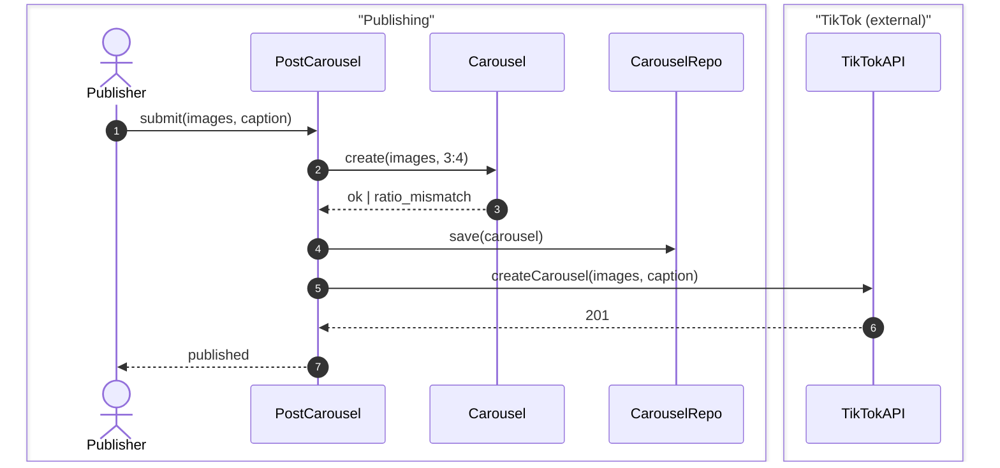

# 1. Example pass

## Playback

```markdown
**Today** - A customer submits a basket and the API service creates an order straight away. No payment is taken at checkout; someone settles each order by hand afterwards.

**The ask** - Take a card payment at checkout, so an order only exists once it has been paid for.

**Diagram** - < today's flow, as a sequence diagram >

**This pass settles** - what a successful card payment and a declined card do to checkout. Refunds and saved cards go to Unresolved, each with its route.

Is that the problem as you see it?
```

## Round

```markdown
**A declined card, then a second card**

A customer's first card is declined. They stay on the basket, try a second card, and it goes through. Today the order row is written when the basket is submitted, before any payment call, so the declined attempt already has an order sitting behind it.

---

❓ **Q1** - **What a declined retry leaves behind**: when a customer's first card is declined and their second is accepted, does the second attempt reuse the order row the first one wrote, write a new row, or does no order exist until a payment succeeds?

**Impact** - 11 of the 80 declined checkouts in the last 30 days retry and succeed, counted from `payment_attempts`: each leaves a declined attempt beside a live order for one basket, and support has no way to say which row is the customer's.

➡️ **No order until payment succeeds** - a declined payment is not an order, and reusing the row leaves a total and a status that disagree the moment the basket changes between attempts.

↳ `apps/api/src/checkout/basket.ts:88` mints an order at submit, before any payment call.

- **A.** One row per basket; the second attempt updates it.
- **B.** One row per attempt; abandoned rows are swept later.
- **C.** No order row until payment succeeds.

---

❓ **Q2** - **What the customer sees after a decline**: when the first card is declined, does the customer stay on the basket with the decline reason shown, or go to a separate retry page?

➡️ **Stay on the basket** - the basket is already the page they trust, and a retry page is a second place the basket's contents could drift.

↳ `apps/web/src/checkout/Basket.tsx:120` already renders an inline error slot, unused today.
```

## Design

````markdown
**Design - the payment gate**

Checkout asks one module whether a basket may become an order. The provider, its retries and its webhooks sit behind it, so checkout never learns which provider is in use.

```ts
interface PaymentGate {
  charge(basketId: BasketId, card: CardToken): Promise<ChargeResult>
}

type ChargeResult =
  | { kind: 'paid'; orderId: OrderId }
  | { kind: 'declined'; reason: DeclineReason }
```

A caller:

```ts
const result: ChargeResult = await paymentGate.charge(basket.id, card)
if (result.kind === 'declined') return showDecline(result.reason)
return redirectToOrder(result.orderId)
```

**Invariants** - an `OrderId` exists only on `paid`. **Errors** - a provider timeout returns `declined` with reason `unavailable`; `charge` never throws.

**Diagram** - < the checkout flow through `PaymentGate`, where it changes >

---

❓ **Q1** - **Whether the gate writes the order**: does `PaymentGate.charge` write the order row itself on `paid`, or return and leave checkout to write it?

➡️ **The gate writes it** - an order and its payment then land together or not at all, and no caller can hold a `paid` result with no order behind it.

↳ `apps/api/src/orders/orderRepo.ts:12` exposes `create` to any caller today; nothing ties it to a payment.
````

# 2. Example Diagrams

## Sequence diagrams (mermaid)

Always `autonumber`, immediately after the opening line. Participants declared with the DDD role they play, grouped by bounded context.


```mermaid
sequenceDiagram
    autonumber
    box "Publishing"
        actor U as Publisher
        participant PC as PostCarousel
        participant C as Carousel
        participant R as CarouselRepo
    end
    box "TikTok (external)"
        participant T as TikTokAPI
    end
    U->>PC: submit(images, caption)
    PC->>C: create(images, 3:4)
    C-->>PC: ok | ratio_mismatch
    PC->>R: save(carousel)
    PC->>T: createCarousel(images, caption)
    T-->>PC: 201
    PC-->>U: published
```

Use `alt/else` blocks where necessary. Keep the diagrams concise and easy to understand. Deep diagrams only come from a specific request from the user.

# 3. Alignment Artefacts

## Captured ticket (multiple passes)
Alignment passes aren't always one session, in a bigger plan, create an artefact ticket in the following shape:

### Alignment ticket title

A good title contains the thing you would grep for: a component, endpoint, file, flag, or number. A title that names a feeling is not a ticket.

| Bad | Good | What changed |
|---|---|---|
| "Login broken" | "Session cookie not set on Safari 17 after OAuth redirect" | Symptom → observable fact with scope |
| "Fix bug in checkout" | "Order total ignores discount code when cart has >1 item" | Names the input condition and wrong output |
| "Improve performance" | "Reduce `/search` p95 latency from 4.2s to under 500ms" | Vague wish → measurable target |
| "Investigate DB issue" | "Postgres connection pool exhausted under 50 concurrent uploads" | Names the mechanism, not the vibe |
| "Add feature for users" | "Allow users to export transaction history as CSV" | Names actor, action, artifact |
| "Refactor auth" | "Split `AuthService` into token issuance and session lookup" | Says what the split is |
| "Customer complained about emails" | "Welcome email arrives 6 hours late (SendGrid queue backlog)" | Complaint → reproducible behaviour |
| "Update dependencies" | "Upgrade React 17 → 18, remove `ReactDOM.render` calls" | Names the version and the follow-on work |
| "Make UI nicer" | "Align invoice table to design tokens; row height 48px" | Replaces taste with a spec |
| "Something wrong with API" | "`POST /v1/refunds` returns 500 when `amount` is null" | Endpoint, trigger, status code |

### Labels

- needs-alignment (ongoing alignment captured in ticket)
- needs-info (blocked and needs answers from someone/something external to user and agent)
- ready-to-propose (a yes is owed outside the room, before the work can be cut)
- ready-to-cut (ready to hand off to `/cut`)
- ready-to-build (ready to build straight from alignment ticket)

### Body

**Passes: N · Verdict: < aligned | fog | dropped | thin > · Destination: < tickets | proposal | ADR | nothing > · Verified against:** `<sha or ref>`

> If dropped: the reason, in one paragraph, at the top.

# Background context
[ One paragraph on the why; a placeholder's triage notes fold in here at pass 1. ]

# Problem statement
[ One paragraph with a scenario to make this easy to understand by human readers and AI. ]

# Scenarios

| scenario | outcome |
| --- | --- |
| [ Named and concrete — one walk through the system. ] | [ The observable result that ends it, or the unresolved item that stays. ] |

# Decisions

| decision | taken | rejected | because | source |
| --- | --- | --- | --- | --- |
| [ What was settled. ] | [ The choice. ] | [ The alternative, and why it lost. ] | [ The reason the choice holds. ] | [ The pass it came from. ] |

# Axes

**Axes:** n decision · n N/A

| axis | mark | note |
| --- | --- | --- |
| happy path | | |
| limits | | |
| failure | | |
| misuse | | |
| concurrency and idempotency | | |
| permissions | | |
| observability | | |
| rollback | | |
| cost | | |

# Diagram
[ The flow this change moves through, where one changed. ]

# Interfaces

| name | signature | owned | consumed |
| --- | --- | --- | --- |
| [ The interface. ] | [ Its exact shape. ] | [ Who defines it. ] | [ Who reads it. ] |

# Acceptance criteria

- [ ] [ Each falsifiable, traced to the scenario it makes pass, with the command that decides it and the evidence that counts as passing. ]

# Boundaries

**Always** · **Ask first** · **Never**

# Unresolved
[ Empty, or one route per entry — what would settle it, and where it is looked up. ]

# Out of scope
[ Numbered, short, each with the reason it was rejected. ]

# Sources
[ Each resolving — link, version, date. ]

**Next:** [ The act this close hands to — `/cut`, `/propose`, `/build`, `/align <ref>`, or `stop`. ]

### Comment (passes)
- If alignment proceeds past one session and requires more depth, each comment adds what was discovered in that pass.
- If body already exists on ticket created by someone else or some other route, place the body as is in a comment.
- Each pass is minimal, showing only what was discovered, the body is the alignment truth.

```markdown
**Pass N e.g. Pass 1 · Verdict: < aligned | fog | dropped | thin >**

# Aligned on
[ Concise bullet point list ]

# Outstanding
[ Short bullet point list on what is in the fog, what is blocked, what is preventing this from moving to ready-to-cut or ready-to-build ]

# Sources
[ Short bullet point list on any relevant sources from this pass ]    
```

## Placeholder (written by `/triage`)

A raw line queued at `needs-alignment`: the body above, degenerate to three rows and no `Passes:` header. The first alignment pass folds the notes into Background and writes the header and the rest of the rows over it.

```markdown

# Background context
[ One paragraph on how the work arrived, and why it is worth a pass. ]

# Problem statement
[ One paragraph on what is wanted or wrong, in the words of whoever brought it. ]

# Triage notes
[ What triage established: the category, where the codebase already stands, any prior rejection surfaced, and the route when one was named. ]

```
