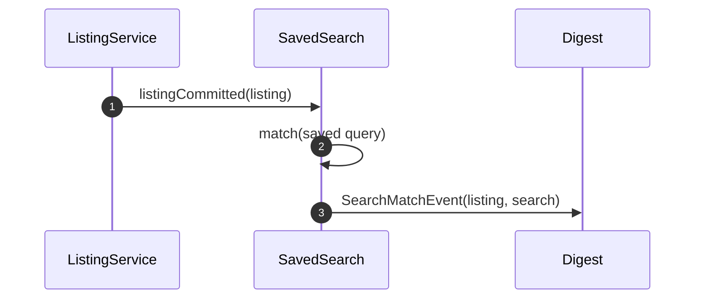

# Worked cut

One alignment (#228) cut into a spec node and three slices. The spec body follows [SPEC.md](SPEC.md); each slice body follows [TICKET.md](TICKET.md). Titles are the nodes' own; the bodies are what `/cut` transcribes.

## The spec node — `Saved-search alerts` (#231)

````markdown
> Alignment: #228

Every saved search alerts the shopper when a matching listing lands.

# Scenarios

| scenario | slice | blocked by |
| --- | --- | --- |
| S1 a shopper saves a search and a matching listing lands | #232 | — |
| S2 a search that matches nothing stays quiet | #233 | #232 |
| S3 a shopper deletes a search and its alerts stop | #234 | #232 |

# Interfaces

| interface | signature | consumed by |
| --- | --- | --- |
| `SearchMatchEvent` | `(listing_id, saved_search_id, matched_at)` | #232, #233 |
| `SavedSearchStore` | `find(query)`, `list(account_id)`, `delete(id)` | #232, #234 |

# Decisions

| decision | taken | rejected | because |
| --- | --- | --- | --- |
| the alert channel | the existing daily digest | push | no client carries it, and it costs a permission the feature does not need |
| the dedupe window | 24 hours per search | one alert per listing | a busy search would flood the digest |

# Out of scope

1. Saved searches on sold listings — the index drops them at sale; resurrecting one is a separate domain decision, not a filter.

# Unresolved

None.

# Sources

- Alignment #228, pass 3 — the `SearchMatchEvent` shape, the digest decision.
````

## Slice #232 — `A saved search alerts once when a matching listing lands`

````markdown
> Spec: #231 · Alignment: #228

# Scenarios

| scenario | outcome |
| --- | --- |
| S1 a shopper saves a search and a matching listing lands | the next daily digest carries the listing once |

# Acceptance criteria

- [ ] A committed listing matching one saved search emits one `SearchMatchEvent` — `mix test test/saved_search/match_test.exs` → `1 test, 0 failures`
- [ ] A second matching listing inside 24 hours adds no second digest row — `mix test test/saved_search/dedupe_test.exs` → green

# Interfaces

| name | signature | inputs | outputs | owned | consumed |
| --- | --- | --- | --- | --- | --- |
| `SearchMatchEvent` | `(listing_id, saved_search_id, matched_at)` | the committed listing | the digest row | yes | — |
| `SavedSearchStore` | `find(query)`, `list(account_id)` | the saved query, the account | matching ids | — | yes |

# Decisions

| decision | taken | rejected | because | source |
| --- | --- | --- | --- | --- |
| the alert channel | the existing daily digest | push | no client carries it, and it costs a permission the feature does not need | #228 · pass 3 |
| the dedupe window | 24 hours per search | one alert per listing | a busy search would flood the digest | #228 · pass 3 |

# Diagram

The match path this slice owns — `ListingCommitted` to `SearchMatchEvent`; the digest's send path is out of frame.



# Where the work lands

| surface | pattern |
| --- | --- |
| `lib/listings/saved_search.ex` | one module per aggregate; `match/2` is pure |
| `test/saved_search/match_test.exs` | a committed listing in, an event out |

# Boundaries

**Always** — copy the saved query verbatim into the event; the digest re-reads nothing.
**Ask first** — a change to `SearchMatchEvent`'s shape; #233 and the digest both consume it.
**Never** — widen the match window to make a test pass; the window is the contract.

# Out of scope

1. Ranking the matches — the digest orders by recency, and a relevance order is its own decision.

# Blocked by

None.

# Unresolved

None.

# Sources

- Alignment #228, pass 3 — the `SearchMatchEvent` shape and the digest decision.
- `lib/listings/listing.ex:88` — the commit path the event hangs off.
````

## Slice #233 — `A saved search that matches nothing sends no digest row`

Its `# Diagram` row is absent because the slice changes no diagram; the rest of the body is the same shape.

````markdown
> Spec: #231 · Alignment: #228

# Scenarios

| scenario | outcome |
| --- | --- |
| S2 a search that matches nothing stays quiet | no digest row appears, and the digest still sends for the account's other searches |

# Acceptance criteria

- [ ] A committed listing matching no saved search emits no `SearchMatchEvent` — `mix test test/saved_search/no_match_test.exs` → green
- [ ] An account with one matchless search and one match still receives the digest for the match — `mix test test/digest/partial_test.exs` → green

# Interfaces

| name | signature | inputs | outputs | owned | consumed |
| --- | --- | --- | --- | --- | --- |
| `SearchMatchEvent` | `(listing_id, saved_search_id, matched_at)` | the committed listing | — | — | yes |

# Decisions

| decision | taken | rejected | because | source |
| --- | --- | --- | --- | --- |
| an empty match set | skip the search, send the rest | suppress the whole digest | a quiet search would silence the account's other alerts | #228 · pass 3 |

# Where the work lands

| surface | pattern |
| --- | --- |
| `lib/listings/saved_search.ex` | `match/2` returns `[]`; the digest filters, never branches on nil |
| `test/saved_search/no_match_test.exs` | a committed listing in, no event out |

# Boundaries

**Always** — keep the digest's send decision per account, not per search.
**Ask first** — a change to how the digest collects events; it is shared with #232.
**Never** — invent a placeholder row to keep the digest's shape.

# Out of scope

1. Notifying that a search has gone quiet — a notification about the absence of notifications.

# Blocked by

#232.

# Unresolved

None.

# Sources

- Alignment #228, pass 3 — the empty-match decision.
````

## Slice #234 — `Deleting a saved search stops its alerts`

````markdown
> Spec: #231 · Alignment: #228

# Scenarios

| scenario | outcome |
| --- | --- |
| S3 a shopper deletes a search and its alerts stop | no digest row for that search after the delete commits |

# Acceptance criteria

- [ ] A deleted search emits no `SearchMatchEvent` for a listing committed afterwards — `mix test test/saved_search/delete_test.exs` → green
- [ ] A listing committed before the delete still appears in the next digest — `mix test test/digest/pending_test.exs` → green

# Interfaces

| name | signature | inputs | outputs | owned | consumed |
| --- | --- | --- | --- | --- | --- |
| `SavedSearchStore` | `delete(id)` | the search id | the search is gone | — | yes |

# Decisions

| decision | taken | rejected | because | source |
| --- | --- | --- | --- | --- |
| a pending match at delete time | the digest still sends it | drop it with the search | the match happened before the delete, and dropping it loses an alert the shopper already earned | #228 · pass 3 |

# Where the work lands

| surface | pattern |
| --- | --- |
| `lib/listings/saved_search.ex` | `delete/1` commits, then the match reader stops seeing the row |
| `test/saved_search/delete_test.exs` | delete, commit a listing, no event |

# Boundaries

**Always** — read the search set at digest assembly, not at match time.
**Ask first** — a change to the delete path's ordering; #232's dedupe reads the same rows.
**Never** — soft-delete to keep the tests green; the contract says the alerts stop.

# Out of scope

1. Undo a delete — a restore is a new search with a new id.

# Blocked by

#232.

# Unresolved

None.

# Sources

- Alignment #228, pass 3 — the pending-match decision.
````
